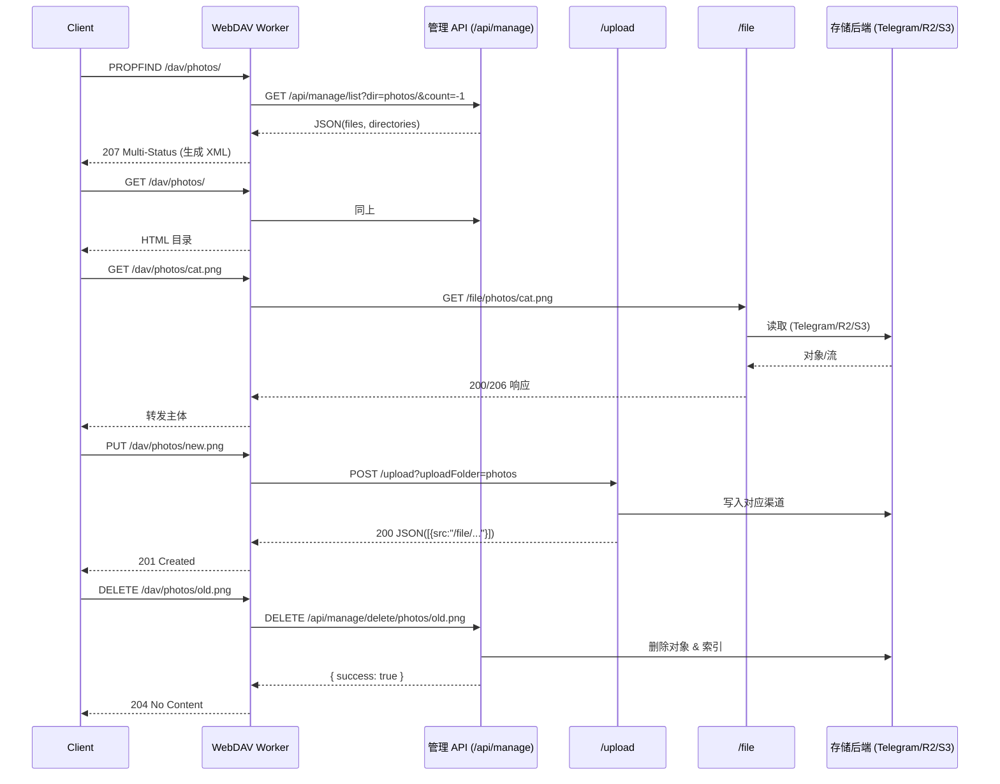

# CloudFlare-ImgBed WebDAV 功能实现分析

## 0. 概要
CloudFlare-ImgBed 的 WebDAV 能力完全由 Cloudflare Pages Functions 提供，入口位于 `functions/dav/[[path]].js`。该 Worker 将 `/dav/*` 请求转换为内部已有的上传、文件索引和删除 API，因此自身不直接操作存储，而是复用已有的 Telegram、Cloudflare R2、S3 以及外链通道。下文对核心文件、请求流程、协议支持范围和性能特点做了逐项拆解。

---

## 1. 路由与代码定位
| 路径 | 作用 |
| --- | --- |
| `functions/dav/[[path]].js` | WebDAV 入口，分发 OPTIONS / PROPFIND / GET / PUT / DELETE / MKCOL |
| `functions/api/manage/list.js` | WebDAV 目录读取依赖的文件索引 API |
| `functions/api/manage/delete/[[path]].js` | WebDAV 删除操作调用的管理端 API，负责真正删除存储与索引 |
| `functions/api/manage/move/[[path]].js` | 提供目录/文件移动能力，但当前 WebDAV 未映射到 MOVE 方法 |
| `functions/upload/index.js` | `/upload` 入口，承载 PUT 上传转换到 Telegram/R2/S3/External |
| `functions/file/[[path]].js` | `/file/*` 下载入口，封装多渠道取文件与 Range 支持 |
| `functions/utils/sysConfig.js` & `functions/api/manage/sysConfig/others.js` | 负责读取 WebDAV 开关、账号等配置 |
| `functions/utils/databaseAdapter.js` | 统一封装 KV 与 D1，所有 API 的元数据读写都通过该适配器完成 |

Cloudflare Pages Functions 以目录结构映射路由：`functions/dav/[[path]].js` 自动接收 `/dav/*`，而 `functions/file/[[path]].js` 对应 `/file/*`，无需额外路由配置。

---

## 2. 认证机制与配置来源
1. **启用与账号来源**：`checkAuth()`（`functions/dav/[[path]].js`, L48-L75）会读取 `fetchOthersConfig(env)`，检查 `othersConfig.webDAV.enabled`，并从 `othersConfig.webDAV.username/password` 读取 Basic 凭据。若未配置凭据则允许匿名访问，否则返回 `WWW-Authenticate: Basic realm="WebDAV"`。
2. **内部 API 调用凭据**：WebDAV 自身不具备上传/删除权限，它通过 `getApiHeaders()`（L28-L45）向 `/upload` 与 `/api/manage/*` 请求时带上管理后台的 Basic 认证信息（来自 `fetchSecurityConfig(env)` 的 `adminUsername/adminPassword`）以及 `authCode` header，从而复用管理 API 现有的认证链路（`functions/api/manage/_middleware.js` 与 `functions/utils/userAuth.js`）。
3. **权限控制**：`functions/upload/index.js` 在进入 `processFileUpload` 前会调用 `userAuthCheck()`，先验证 API Token，再回退到 `authCode`。因此，即使 WebDAV Basic 通过，也必须提供正确 `authCode`（由 WebDAV Worker 自动附带）才能落地到上传服务。

---

## 3. WebDAV 方法与对应逻辑
| HTTP 方法 | WebDAV Handler | 后端动作 | 备注 |
| --- | --- | --- | --- |
| OPTIONS | `handleOptions` | 回应 `Allow` 与 `DAV: 1,2` | 仅声明支持的方法集合 |
| PROPFIND | `handlePropfind` | 调用 `fetchDirectoryContents` → `/api/manage/list` | 返回 207 Multi-Status XML（见 §4） |
| GET（目录） | `handleGet` | 同 PROPFIND，但渲染 HTML 索引 | 提供浏览器友好的列表 |
| GET（文件） | `handleGet` | 反向代理到 `/file/<path>` | `/file` Worker 负责鉴权、Range、后端取文件 |
| PUT | `handlePut` | 构造 `FormData` → POST `/upload` | 支持 `uploadFolder` 查询参数；底层走 Telegram/R2/S3/External |
| DELETE | `handleDelete` | 调用 `/api/manage/delete/{path}` | 支持 `folder=true` 递归删除 |
| MKCOL | 直接 `201 Created` | 没有真正创建目录 | 目录来自文件 ID 的 `Directory` 元数据 |
| MOVE / COPY / LOCK etc. | 未实现 | — | 需要直接调用管理 API（`/api/manage/move`）才能移动 |

> **结论**：WebDAV 提供的是“文件视图 + 上传/删除”包装层，依赖现有 REST API 完成实际数据操作。

---

## 4. 目录列举与属性生成
### 4.1 目录数据来源
- `fetchDirectoryContents(dir, env, request)`（L207-L232）会向 `/api/manage/list?dir=<dir>&count=-1` 发起请求。
- `functions/api/manage/list.js` 首选 `readIndex()`（基于 `indexManager` KV/D1 索引），若失败则回退到 `getAllFileRecords()`，遍历数据库键并从 `metadata.Directory` 划分目录层级。
- 目录去重后返回 `{ files, directories }`，其中 `files[i].metadata` 包含 `Channel`, `FileName`, `FileSize`, `Directory`, `TimeStamp` 等。

### 4.2 HTML 与 XML 输出
- 目录 GET 最终由 `generateDirectoryListingHtml()`（L236-L262）生成简单列表，其中文件大小读取 `metadata['FileSize']`（MB 文本），目录链接指向 `/dav/<dir>/`。
- PROPFIND 调用 `generateWebDAVXml()` (L264-L277)：
  - 根路径先通过 `createCollectionXml()`（L279-L284）添加当前目录，`creationdate/getlastmodified` 使用当前时间（非真实时间戳）。
  - 子目录依次追加 `<D:collection/>` 响应。
  - 文件节点由 `createFileXml()`（L286-L290）生成，使用 `metadata['File-Size']`（注意此键带连字符，若存储的是 `FileSize` 将导致 `getcontentlength` 缺失）。
- 属性覆盖范围：`displayname`, `resourcetype`, `creationdate`, `getlastmodified`, `getcontentlength`，没有扩展属性（权限、ETag、自定义 metadata 均未暴露）。

### 4.3 限制
- 请求 `count=-1` 会一次性加载整个目录（无分页）；大目录需要依赖索引快速过滤。
- MKCOL 不会创建占位目录，目录存在完全取决于文件 `metadata.Directory`。

---

## 5. PUT 上传到多存储通道
1. `handlePut()`（L125-L162）解析路径，拆分 `uploadFolder` 与文件名，将请求体转换为 `FormData`。
2. 请求被 POST 到 `/upload?uploadFolder=<...>`，并携带 `Authorization: Basic <admin>` 与 `authCode` header。
3. `/upload` Worker（`functions/upload/index.js`）：
   - 通过 `userAuthCheck()` 验证 Token/authCode（来自 header 或 URL）。
   - 解析 `uploadChannel` 查询参数，映射到实际渠道：`telegram`→`TelegramNew`、`cfr2`→`CloudflareR2`、`s3`→`S3`、默认 Telegram。
   - `processFileUpload()` 创建 metadata（`Channel`, `Directory`, `FileSize`, `Tags`, `TimeStamp` 等），并构建 `fileId`（可按 index/origin/short/默认规则）。
4. 不同存储渠道：
   - **Cloudflare R2** (`uploadFileToCloudflareR2`)：直接 `env.img_r2.put(fullId, file)`, metadata 标记 `Channel=CloudflareR2` 并写入 KV/D1。
   - **S3 兼容** (`uploadFileToS3`)：借助 `@aws-sdk/client-s3` 的 `PutObjectCommand` 上传到自定义 endpoint，metadata 储存访问凭据、Bucket/Key/Region，用于后续删除与下载。
   - **Telegram** (`uploadFileToTelegram`)：通过 `TelegramAPI` 上传，支持 20MB 分片（参见 `uploadLargeFileToTelegram`），metadata 保存 `TgFileId/BotToken/ChatId`。GIF/WEBP 会重命名避免被转换成视频。
   - **External** (`uploadFileToExternal`)：只保存外链 URL，不存储实际对象。
5. 上传完成后执行 `endUpload()`：
   - 调用 `purgeCDNCache` 清理 `/file/<id>` 的 CDN 缓存以及 `api/randomFileList`。
   - 调 `addFileToIndex()` 更新目录索引，以便 WebDAV 列表能立即看到新文件。

---

## 6. GET 下载的链路
1. `handleGet()` 区分目录/文件：
   - 目录以 `/` 结尾 → `fetchDirectoryContents` → HTML 列表。
   - 文件 → 构造 `/file<path>` URL 并 `fetch()`。
2. `/file/[[path]].js` 承担实际下载：
   - `fetchSecurityConfig()` 决定 Referer 白名单和 Token 校验（通过 `returnWithCheck`）。
   - 读取数据库记录：`metadata.Channel` 决定分支。
   - **Cloudflare R2**：`env.img_r2.get()`，支持 Range 请求并设置 `Content-Range`（L331-L405）。
   - **S3**：使用 `GetObjectCommand`，支持 `Range` 与 `HEAD`（L405-L466）。
   - **Telegram / Telegraph**：根据 `metadata.TgFileId` 走 Telegram API；如果 `IsChunked` 为 true，则通过 `handleTelegramChunkedFile()` 流式重组所有分片，并提供 Range/304/ETag（L141-L330）。
   - **External**：直接 302 跳转到 `metadata.ExternalLink`。
3. 下载响应统一通过 `setCommonHeaders` 设置 `Content-Type`, `Content-Disposition`, `Cache-Control` 等，并允许 Range（对 chunked/R2/S3）。
4. 因此 WebDAV GET 实际支持断点续传/范围请求，只要底层 `/file` 通道支持。

---

## 7. DELETE / 目录清理与 MOVE 能力
1. `handleDelete()`（L164-L190）解析路径：
   - 尾部 `/` 视为目录，调用 `/api/manage/delete/<dir>?folder=true`，由管理 API 递归列出并删除全部文件（参考 `functions/api/manage/delete/[[path]].js`, L11-L75）。
   - 普通文件则调用 `/api/manage/delete/<fileId>`。
2. 管理删除 API 的关键步骤：
   - 使用 `getDatabase(env)` 读取文件 metadata。
   - 若 `Channel=CloudflareR2`，调用 `env.img_r2.delete(fileId)`；若 `Channel=S3`，构造 `DeleteObjectCommand`。
   - 删除 KV/D1 记录后调用 `purgeCFCache()`，并清理 `api/randomFileList` 缓存。
   - 同步更新索引：`removeFileFromIndex` / `batchRemoveFilesFromIndex`。
3. **MOVE**：尽管存在 `/api/manage/move/[[path]].js`（支持批量目录移动并更新 R2/S3 和索引），WebDAV Worker 并未暴露 MOVE 方法，因此 WebDAV 客户端无法通过标准 MOVE 实现重命名/迁移，必须调用管理 API。

---

## 8. 属性处理与目录结构
- **目录结构**：纯虚拟，来源于 KV/D1 中 `metadata.Directory`（以 `aaa/bbb/` 形式存储）。没有单独的目录对象，因此 MKCOL 只返回 201 以满足客户端流程，但不会创建实体。
- **属性来源**：
  - 目录/文件名称取自路径最后一段。
   - `creationdate`/`getlastmodified` 使用 `new Date().toUTCString()`（请求时间），无法反映真实上传时间。
  - `getcontentlength` 依赖 `metadata['File-Size']`，若上传流程只写入 `FileSize` 将导致长度缺失。
  - 未公开额外属性（如自定义标签、权限、etag、media-type）。
- **HTML 列表**：`generateDirectoryListingHtml()` 仅包含名称 + `FileSize`（MB）。

---

## 9. 请求流程可视化

---

## 10. 与存储后端的集成
| 通道 | 上传实现 | 下载实现 | 删除实现 | 元数据要点 |
| --- | --- | --- | --- | --- |
| Telegram (`Channel=TelegramNew`) | `TelegramAPI.sendFile`/分片上传；保存 `TgFileId/TgBotToken/TgChatId` | `/file` 通过 Telegram API 拉流；分片文件由 Worker 重组并支持 Range | 管理删除只移除 KV 记录与索引（Telegram 无法远程删除） | `FileSize`, `IsChunked`, `TotalChunks`, `Directory` |
| Cloudflare R2 (`Channel=CloudflareR2`) | `env.img_r2.put` | `env.img_r2.get` + Range | `env.img_r2.delete` | Metadata 仅需 `Channel`、`Directory` |
| S3/兼容 (`Channel=S3`) | `@aws-sdk/client-s3 PutObjectCommand` | `GetObjectCommand`，保留 Range/HEAD | `DeleteObjectCommand`（移动时使用 Copy + Delete） | 存储 `S3Endpoint`, `S3BucketName`, `S3FileKey`, `S3AccessKeyId`, `S3SecretAccessKey`, `S3Region`, `S3PathStyle` |
| External (`Channel=External`) | 只保存 `ExternalLink` | `/file` 302 到外链 | 删除仅删 KV 记录 | 依赖外部可用性 |

`functions/utils/databaseAdapter.js` 保证上述操作可在 Workers KV (`env.img_url`) 或 D1 (`env.img_d1`) 间切换，所有 API 调用都通过适配器取得一致接口。

---

## 11. 支持的操作与限制
- ✅ **支持**：OPTIONS、PROPFIND（Depth=1, 无分页）、GET、PUT（普通文件、未声明分块但底层 `/upload` 支持）、DELETE（文件与目录）、MKCOL（仅返回 201）。
- ⚠️ **部分支持**：范围请求仅对文件有效（由 `/file` 负责）；属性固定，无法扩展；目录结构取决于文件路径。
- ❌ **不支持**：MOVE/ COPY/ LOCK/ UNLOCK/ PROPPATCH/ REPORT/ SEARCH；也没有版本控制、校验和、服务器端重命名。
- 📁 **目录管理**：无法创建空目录，必须通过上传带前缀的文件来“生成”目录；删除目录会递归删除所有文件。

---

## 12. 性能、缓存与可扩展性
1. **索引依赖**：`/api/manage/list` 倚赖 `indexManager` 维护的文件索引 (`addFileToIndex`, `removeFileFromIndex`)。若索引失效会回落到 KV 全量扫描，导致 PROPFIND/目录 GET 性能降低。
2. **无分页**：`count = -1` 在大目录下会放大延迟与内存占用，可考虑后续引入 Depth + Limit 参数。
3. **缓存策略**：
   - `/file` 针对 Telegram 分片添加 `ETag` 与 304 处理；R2/S3 场景允许 Range 并复用对象存储缓存。
   - 删除/上传都会调用 `purgeCFCache` 以及 Cloudflare Cache API 以保持 `/file`、`api/randomFileList` 一致。
   - WebDAV 目录 HTML/XML 未设置显式缓存头，客户端通常每次都会重新拉取。
4. **目录 HTML**：简单模板，适合浏览器调试，但不包含分页/排序。

---

## 13. 使用建议
- 启用 WebDAV 前需在后台「其他设置」配置 `webDAV.enabled=true` 及 Basic 账号，避免匿名访问。
- 确保后台「安全设置」中已设置管理员用户名/密码与 `authCode`，否则 WebDAV 无法成功调用 `/upload` 与管理 API。
- 若需要移动/重命名，请直接调用 `/api/manage/move`（或在前端增加 MOVE 映射），因为 WebDAV 层尚未实现 MOVE 方法。
- 大批量目录操作建议预先重建索引（`/api/manage/list?action=rebuild`）以避免 PROPFIND 超时。
- 对于依赖真实元数据（时间/权限）的客户端，需要注意当前实现只返回请求时刻的时间戳且缺少权限属性，可在 `createFileXml/createCollectionXml` 中扩展。

---

**结论**：CloudFlare-ImgBed 的 WebDAV 实际是对现有 API 的“薄适配”，通过 Basic 认证 + 管理 API 把 Telegram/R2/S3 的上传、下载、删除能力呈现为 WebDAV 协议。其长处是复用成熟的上传逻辑（含内容审查、索引、缓存失效），局限则在于协议覆盖面有限（无 MOVE/COPY/PROPPATCH）以及属性信息较少，目录列举缺乏分页。后续如果需要完整的 WebDAV 体验，可在现有 Worker 基础上继续扩展方法映射并丰富属性生成逻辑。